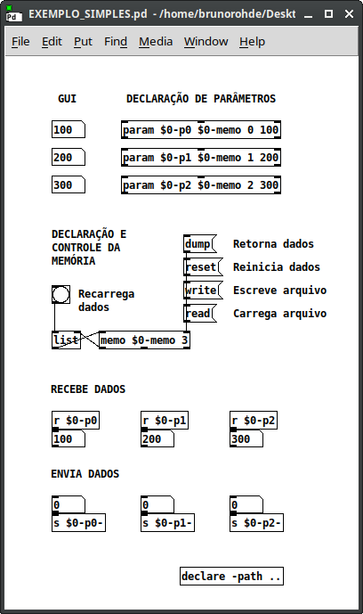
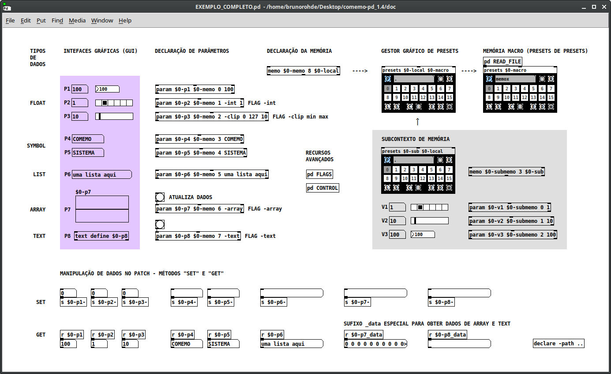

# COMEMO-PD – Sistema de controle e memória modular para Pure Data Vanilla

---

Versão 1.4 (maio 2025)

https://github.com/brunorohde/comemo-pd

Copyleft 2025 Bruno Faria Rohde – GPLV3 license – http://www.gnu.org/licenses/gpl.txt

---

## Visão geral

COMEMO-PD é um sistema de gestão de parâmetros para patches de Pd Vanilla, ou seja, sem dependência de bibliotecas adicionais, conhecidas como externals. O sistema possui dois propósitos centrais: permitir a criação de composições a partir do registro de estados/cenas, especialmente em patches com muitos controles; e simplificar a criação de softwares utilizando o Pd como linguagem de programação, padronizando a implementação de parâmetros de controle com diversos tipos de dados. O pacote é composto por abstrações que funcionam de modo interligado, possibilitando receber e enviar dados dos parâmetros de um patch seguindo um padrão simples de comunicação, gerenciar a visualização do estado desses parâmetros em um ou mais objetos gráficos na interface, bem como armazenar seus dados em presets e arquivos de texto para recuperação posterior.

Exemplos de projetos que utilizam o sistema são o [\[ARRAST_VJ\]](https://github.com/brunorohde/ARRAST_VJ "[ARRAST_VJ]"), [ESMERIL](https://github.com/brunorohde/ESMERIL "ESMERIL"), [SINAPSE](https://github.com/brunorohde/SINAPSE "SINAPSE") e [FETXT](https://github.com/brunorohde/FETXT "FETXT"). Durante o desenvolvimento desses e outros projetos, surgiu a necessidade de simplificar o processo de implementação e gestão de parâmetros com uma solução própria, dando origem às abstrações que foram então organizadas e documentadas no COMEMO-PD.

Dois exemplos de uso do sistema são disponibilizados no repositório do projeto, na pasta doc/. O arquivo **EXEMPLO_SIMPLES.pd** será utilizado como ponto de partida para explicar a estrutura mínima necessária em uma implementação utilizando apenas parâmetros numéricos, como pode ser visto na *FIGURA 1*. O arquivo **EXEMPLO_COMPLETO.pd** demonstra uma aplicação com outros tipos de dados (símbolos, listas, arrays e textos), métodos de acesso e controle remoto dos parâmetros, recursos adicionais com uso de flags, gerenciamento gráfico de presets, agrupamento e camadas de memórias. Nas próximas sessões serão comentadas cada uma das abstrações principais no que se refere a suas propriedades e utilização em contexto.

*FIGURA 1 - Patch EXEMPLO_SIMPLES.pd que demonstra uma implementação básica do COMEMO-PD com suas principais abstrações*

	 

A implementação de COMEMO-PD em um patch segue procedimentos simples, que podem ser escalados e complexificados de acordo com a necessidade. Após o download da biblioteca no repositório, o primeiro passo é declará-la como dependência utilizando o objeto \[declare -path comemo-pd], considerando que a pasta baixada se encontra no mesmo diretório do patch. A seguir, uma vez definidos os parâmetros de controle utilizados, são necessárias as seguintes etapas, executadas em qualquer ordem: declaração das abstrações \[param] respectivas a cada parâmetro; declaração da abstração \[memo] responsável pela memória do contexto; e padronização dos símbolos internos de envio e recebimento de dados nos elementos gráficos (GUI) que representam os parâmetros. Utilizando apenas os métodos próprios dessas duas abstrações, já teremos um sistema funcional capaz do armazenamento de cenas em objetos \[list] ou arquivos de texto.

## Abstração \[param]

Para cada parâmetro de uma composição ou programa, deve ser declarada uma instância da abstração \[param], tendo como argumentos obrigatórios o nome do parâmetro, o nome do bloco de memória \[memo] ao qual pertence, e o índice de posição na memória, que influencia na ordem de carregamento de dados, recurso comumente necessário para ordenar processos no código. Como argumentos opcionais, podem ser passadas flags que controlam recursos adicionais (apresentados adiante), seguidas de um valor ou lista de valores de inicialização.

A abstração \[param] atua como um atom multiuso, sendo seu elemento central um objeto \[list] utilizado como espaço genérico de memória local que permite o armazenamento e manipulação de qualquer dos tipos básicos de dados no Pd – números, símbolos e listas. Ela fornece métodos para acesso e edição quente e fria dos dados, tanto local quanto remotamente, seguindo padrões simples de comunicação que podem ser consultados diretamente em seu código ou arquivo de ajuda.

Quando o valor de um parâmetro é alterado pela interface ou pelo patch, esse valor é enviado nas diferentes saídas locais e remotas, e também enviado para o gestor \[memo] declarado, na forma de uma lista contendo o índice na memória, o número de itens armazenados (1 ou mais, no caso de listas), e os itens em si. Também ocorre a comunicação com um ou mais objetos gráficos (GUI) respectivos ao tipo de dado, possibilitando o isolamento entre interface gráfica e engrenagem do patch, recurso frequentemente necessário.

A gestão de elementos gráficos que representam os parâmetros permite que sejam utilizadas múltiplas caixas de número, símbolo ou lista em diferentes partes do código relacionadas ao mesmo controle sem conflito e com atualização instantânea em todo o sistema. O mesmo se aplica, evidentemente, a todos os elementos gráficos nativos do Pd, bem como externals que façam uso do mesmo padrão de comunicação via \[send] e \[receive]. Esse é um recurso bastante útil, por exemplo, quando um dado parâmetro precisa ser acessado e exibido de diferentes formas em diferentes partes de uma interface complexa. Cada objeto gráfico deve ter seus símbolos internos de envio e recebimento nomeados no padrão $PARAM\_gui e $PARAM\_gui_set, respectivamente, sendo $PARAM substituído pelo nome do parâmetro.

## Abstração \[memo]

Todos os \[param] de um contexto enviam seus valores para um \[memo] comum, que é um gerenciador de memória indexada utilizando o objeto \[text]. A abstração possui métodos locais e remotos que permitem manipular diretamente seu conteúdo, bem como exportar e carregar arquivos de texto com os dados de todos os parâmetros respectivos. Também é possível configurar um sistema simples de presets obtendo, com o método dump, uma lista com os dados na saída esquerda, a qual pode ser armazenada como mensagem simples e aberta posteriormente enviando o conteúdo de volta à entrada esquerda, conforme pode ser visto na Figura 1 e na documentação completa oferecida em seu código e arquivo de ajuda.

O bloco de memória \[memo] normalmente é instanciado junto à declaração dos parâmetros, utilizando até três argumentos, sendo os dois primeiros obrigatórios: o nome da memória e o número de parâmetros gerenciados. Opcionalmente, pode ser incluído o nome de um contexto de agrupamento superior, como as abstrações \[memolist] e \[presets], discutidas adiante.

Seu funcionamento ocorre em torno de um objeto \[text] que é utilizado para armazenar os dados dos parâmetros obedecendo ao seu índice de posição declarado. Um aspecto central no sistema é que os nomes dos parâmetros não são comunicados e armazenados na memória, o que evita a necessidade de resolver dinamicamente a variável $0, comumente utilizada na programação de abstrações para restringir a comunicação de dados ao nível local, isolando cada instância.

## Abstrações utilitárias e recursos adicionais

O segundo exemplo **(EXEMPLO_COMPLETO.pd)** apresenta a COMEMO-PD com todos os seus recursos e métodos, implementando parâmetros com diferentes tipos de dados – números, símbolos e listas – como pode ser visto na *FIGURA 2*. Além disso, dados contidos em tabelas ou \[array] e também em \[text] podem ser armazenados como parâmetros utilizando as flags correspondentes -array e -text na inicialização dos \[param]. Essas flags habilitam a transformação dos dados em listas no interior da abstração com um bang na entrada quente, e de forma automática sempre que o conteúdo do \[memo] respectivo é obtido com o método *dump*, salvo em arquivo de texto com método write, ou coletado por uma instância superior de memória com as abstrações \[memolist] e \[presets].

*FIGURA 2 - Patch EXEMPLO_COMPLETO.pd demonstrando implementação de COMEMO-PD com tipos de dados variados e recursos especiais com uso de flags*

	 

Em parâmetros numéricos, as flags -int e -clip permitem restringir os valores a números inteiros e a uma faixa de valores determinada, respectivamente. Outros recursos operados com flags ou controle dinâmico estão descritos nos subpatches correspondentes. Entre eles, destaco os mecanismos de interpolação de valores com rampas usando o método *slew*, e os mecanismos de randomização e “drunkard walk”, com os métodos *random* e *drunk*. Todos esses métodos podem ser aplicados a um ou mais parâmetros específicos, mas também em blocos inteiros geridos por um \[memo], ou mesmo em múltiplos blocos gerenciados por um contexto superior.

A biblioteca COMEMO-PD dispõe de um conjunto de abstrações utilitárias – \[memopack], \[memounpack] e \[memolist] – que permitem o agrupamento e gestão de memórias dispersas, facilitando especialmente o processo de desenvolvimento de novos softwares. Nessas situações, é comum que os parâmetros não sejam todos conhecidos de antemão e possam estar dispostos em blocos nas diferentes partes do código. Usando esses recursos, cada um desses blocos pode ser programado independentemente a qualquer momento e ter sua memória local integrada num macrossistema de gestão.

As abstrações \[memopack] e \[memounpack] servem para empacotar e desempacotar, respectivamente, listas com os dados de um conjunto de memórias \[memo], que são informadas através de uma lista com seus nomes. Reunindo suas funcionalidades, \[memolist] contém um mecanismo de coleta de dados já estabelecido, e utiliza o terceiro argumento dos módulos \[memo] para definição de um contexto comum de agrupamento.

No exemplo visto na *FIGURA 2*, esse processo é implementado através do uso da abstração \[presets], um gestor com interface gráfica que utiliza internamente o sistema de agrupamento com \[memolist], permitindo a criação simples de cenas que podem ser alternadas em tempo real ou sequenciadas, bem como exportadas como arquivos de texto. Também é demonstrado seu uso recursivo, sendo que todo conteúdo de um ou mais blocos \[presets] pode ser coletado em \[presets] superiores, o que possibilita a criação de patches com diversas camadas de memórias. Cabe ressaltar que a abstração inclui um terminal para operações entre slots, como copiar, mover e trocar posição, bastante úteis durante um processo de composição, por exemplo.
	
Por fim, a versão atual da biblioteca inclui a abstração \[paramer], um gerador baseado em dynamic patching para criar conjuntos compostos por vários \[param] e o respectivo \[memo], partindo da declaração dos elementos numa lista que pode ser editada e reordenada a qualquer momento. Essa ferramenta reduz muito o trabalho manual de programação a cada vez que novos parâmetros são incluídos, ou mesmo quando desejamos alterar a ordem de declaração dos mesmos, o que impacta na sequência de inicialização do sistema. A utilização de \[paramer] é detalhada e pode ser testada no seu arquivo de ajuda.

---

## VERSÕES

1.4 (05/2025)

- Novas versões de \[presets], \[presets2] e \[presets3] incluindo mecanismo interno para obtenção de cenas
- Modularidade nos \[presets], com conteúdo armazenado em \[param] que pode ser armazenado em contextos superiores
- Mecanismo de flags para configurar recursos adicionais nos \[param]: -array -text -int -clip min max -noslew -norandom -nodrunk -noall -skip
- Métodos de randomização e drunkard walk para parâmetros numéricos: *random* e *drunk*
- Alteração no mecanismo de interpolação com método *slew*, para funcionar a partir de memórias e dos métodos *random* e *drunk*
- Removidas abstrações \[listbox], que podem ser substituídas pelos novos \[presets]
- Revisão e complementação na documentação das abstrações, arquivos de ajuda e texto de apresentação

1.3 (01/2025)

- Alteração no mecanismo de transições: acionado apenas quando carrega presets; qualquer mudança na interface cancela transição no parâmetro

1.2 (09/2024)

- Nova abstração \[paramer] - gerador de conjuntos de parâmetros e memória a partir de lista que facilita implementação e gestão do sistema
- Mecanismo para lembrar última pasta navegada ao salvar ou abrir arquivos de memória - \[memo] e todos \[listbox] atualizados
- Atualização dos arquivos de ajuda (-help.pd)
- Atualização da documentação

1.1 (05/2022) 

- Atualização para Pd 0.52-2
- Suporte à inicialização de listas direto no \[param] e edição com novo atom box

1.0 (09/2021)

- Lançamento do pacote e documentação no Github

