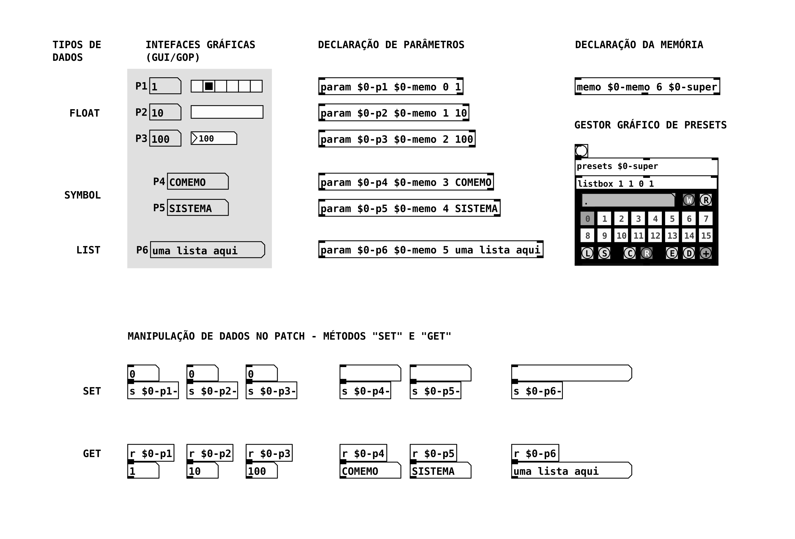
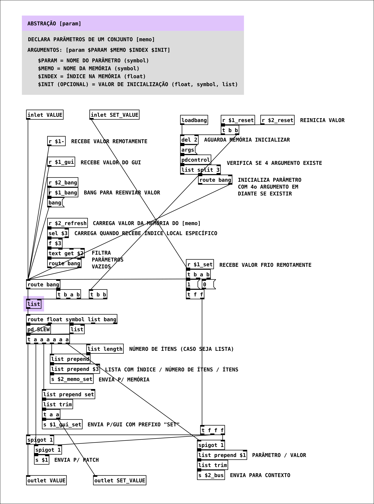
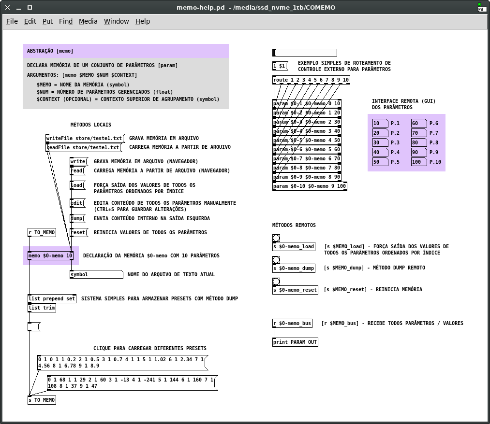

# COMEMO-PD – Sistema de controle e memória modular para Pure Data Vanilla

---

Versão 1.0 (setembro 2021)

https://github.com/brunorohde/comemo-pd

Copyleft 2021 Bruno Faria Rohde – GPLV3 license - http://www.gnu.org/licenses/gpl.txt

---

## Visão geral

O COMEMO-PD é um sistema de gestão de parâmetros para patchs de Pure Data (Pd) Vanilla, ou seja, sem dependência de bibliotecas externas. O sistema é composto por abstrações que funcionam de modo interligado, possibilitando receber e enviar dados dos parâmetros de um patch seguindo um padrão simples de comunicação, gerenciar a visualização do estado desses parâmetros em um ou mais objetos na interface, bem como armazenar seus dados em arquivos de texto para recuperação posterior. Um exemplo básico **(EXEMPLO.pd)** é disponibilizado no repositório do projeto e será utilizado como ponto de partida para apresentar seu uso, sem esgotar as configurações possíveis através de diferentes arranjos e da interação com recursos externos. Nas sessões seguintes serão comentadas cada uma das abstrações principais no que se refere a suas propriedades e utilização em contexto.

A implementação do COMEMO-PD em uma peça ou software em Pd segue procedimentos simples, que podem ser escalados e complexificados de acordo com a necessidade. No patch de exemplo visto na **FIGURA I** estão dispostos os principais módulos de maneira funcional, ilustrando os recursos descritos adiante.

*FIGURA I - Patch EXEMPLO.pd que demonstra uma implementação básica do COMEMO-PD com suas principais abstrações*

	 

Uma vez definidos, mesmo que temporariamente, os parâmetros de controle de determinado patch, são necessárias as seguintes etapas básicas, executadas em qualquer ordem: declaração das abstrações \[param] respectivas a cada parâmetro; declaração da abstração \[memo] responsável pela memória do contexto; e padronização dos símbolos internos de envio e recebimento de dados nos elementos gráficos que representam os parâmetros. Utilizando apenas os métodos próprios dessas duas abstrações teremos um sistema funcional capaz do armazenamento de memórias em arquivos de texto, recurso que resolve a questão de memória para composições e patchs simples, de forma similar a outros projetos disponíveis na comunidade **(CITAR PROJETOS - LINKS)**.

Para além dessa configuração básica, o sistema dispõe ainda de um conjunto de abstrações auxiliares – **\[memopack], \[memounpack], \[memolist], \[listbox] e \[presets]** – que permitem o agrupamento e gestão de memórias dispersas, facilitando especialmente o processo de desenvolvimento de novos softwares em Pd. Nessas situações, é comum que os parâmetros não sejam todos conhecidos de antemão e possam estar dispostos em blocos nas diferentes partes do código. Usando o COMEMO-PD, cada um desses blocos pode ser implementado independentemente a qualquer momento e ter sua memória local integrada num macro sistema de gestão.

## Abstração \[param]

Para cada parâmetro de uma composição ou programa em desenvolvimento deve ser declarada uma instância da abstração \[param], apresentada na **FIGURA II**, que atua como um atom multiuso, sendo seu elemento central um objeto \[list] utilizado como espaço genérico de memória local que permite o armazenamento de qualquer dos tipos básicos de dados no Pd – números, símbolos e listas. A abstração fornece métodos para acesso e edição quente e fria dos dados, tanto local quanto remotamente, seguindo padrões simples de comunicação que podem ser consultados diretamente em seu código ou arquivo de ajuda (param-help.pd). Quando o valor de um parâmetro é alterado ou solicitado pela interface, pelo patch ou pelo sistema de memória, o valor é enviado nas diferentes saídas locais e remotas, e também ocorre a comunicação com um ou mais objetos gráficos (GUI) respectivos ao tipo de dado, possibilitando o isolamento entre interface gráfica e engrenagem do patch, recurso frequentemente necessário.

*FIGURA II - Abstração \[param] que implementa métodos locais e remotos para gestão de um parâmetro em um contexto determinado*

	

A gestão de elementos gráficos (GUI) que representam os parâmetros permite que sejam utilizadas múltiplas caixas de número em diferentes partes do código interno ou da interface representando o mesmo parâmetro sem conflito e com atualização instantânea em todo o sistema. O mesmo se aplica, evidentemente, a todos os elementos gráficos nativos do Pd, bem como externals que façam uso do mesmo padrão de comunicação via \[send] e \[receive]. Esse é um recurso bastante útil, por exemplo, quando um dado parâmetro precisa ser acessado e exibido de diferentes formas em diferentes partes de uma interface complexa.
Um exemplo detalhado do funcionamento pode ser testado no arquivo de ajuda da abstração, correspondente à **FIGURA III**.

*FIGURA III - Arquivo de ajuda param-help.pd que demonstra os detalhes de utilização da abstração \[param], incluindo seus argumentos de inicialização e os métodos locais e remotos para manipulação de dados no sistema*

	

## Abstração \[memo]

Todas os \[param] de um contexto enviam seus valores para um \[memo] comum, que é um gerenciador de memória indexada utilizando o objeto \[text]. A abstração \[memo] possui métodos locais e remotos que permitem manipular diretamente seu conteúdo, bem como exportar e carregar arquivos com os dados de todos os parâmetros respectivos. Também é possível configurar um sistema simples de presets obtendo, com o método *dump*, uma lista com os dados na saída esquerda da abstração, a qual pode ser armazenada como mensagem simples e aberta posteriormente enviando o conteúdo de volta à entrada esquerda.
O gerenciador \[memo] normalmente é instanciado junto à declaração dos parâmetros, utilizando até três argumentos: nome da memória, número de parâmetros gerenciados e, opcionalmente, nome do contexto de agrupamento superior. Seu funcionamento detalhado é apresentado no arquivo de ajuda correspondente, que pode ser visto na **FIGURA IV**.

*FIGURA IV - Arquivo de ajuda memo-help.pd que demonstra os detalhes de utilização da abstração \[memo], incluindo seus argumentos de inicialização e os métodos locais e remotos para controle de blocos de memória*

	

## Abstrações utilitárias

Além das unidades básicas mencionadas acima, com as quais já é possível implementar mecanismos de presets eficientes, ao longo do tempo foram desenvolvidos alguns utilitários, listados abaixo, que permitem realizar a gestão de sistemas mais complexos, com diferentes graus e contextos de memória:

- \[memopack] e \[memounpack]: Servem para empacotar e desempacotar, respectivamente, listas com os dados de um conjunto de memórias \[memo], que são informadas através de um lista com seus nomes.

- \[memolist]: Contém um mecanismo de coleta de dados já estabelecido para facilitar a implementação de grupos, e utiliza o terceiro argumento dos módulos \[memo] para defição de um contexto comum de agrupamento.

- \[listbox], \[listbox2] e \[listbox3]: Gestores de memória para listas com visualização e manipulação simples dos dados armazenados. São utilizados no sistema para, por exemplo, armazenar listas de saída de um \[memo] ou \[memopack] na implementação de um sistema de presets. Além de métodos comuns de edição de conteúdo, como copiar, colar, mover e apagar dados, também é possível exportar e carregar aquivos de texto com as informações armazenadas.

- \[presets], \[presets2] e \[presets3]: Como envelope final para o sistema, foram criadas as abstrações \[presets], que apenas empacotam as funcionalidades de um \[memolist] com uma \[listbox] utilizando também o contexto de agrupamento declarado no terceiro argumento dos \[memo]. A utilização de um gestor gráfico de dados [presets] pode ser vista e testada no arquivo **EXEMPLO.pd (FIGURA I)**.

## Demais pastas (old, proto e store)

- old - arquivo de versões de desenvolvimento do projeto;
- proto - protótipo do sistema de memória utilizando apenas tabelas de números; contém abstrações que podem ser úteis para armazenamento simplificado de dados numéricos;
- store - diretório para armazenar memórias e imagens dos patchs de ajuda e exemplos.